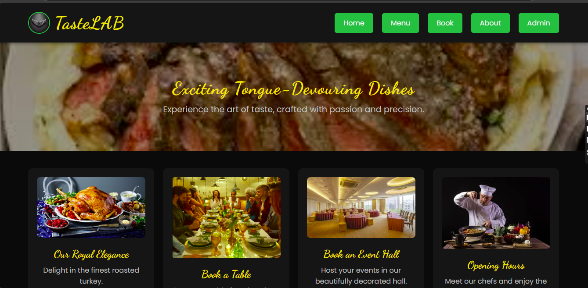
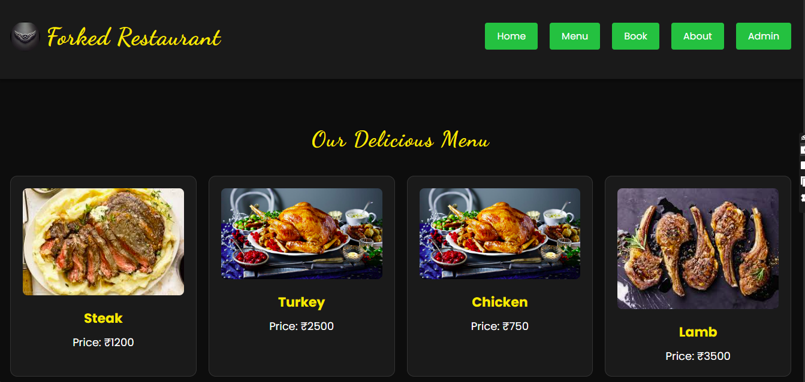
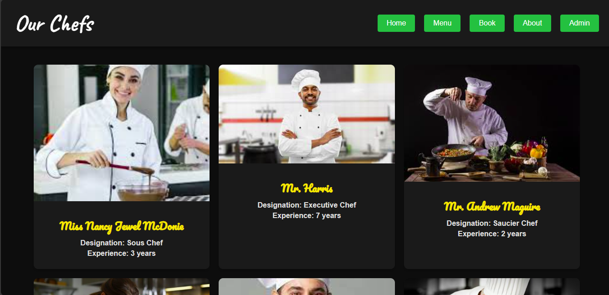

# Ex.07 Restaurant Website
# Date: 27/11/2024
# AIM:
To develop a static Restaurant website to display the food items and services provided by them.

# DESIGN STEPS:
## Step 1:
Requirement collection.

## Step 2:
Creating the layout using HTML and CSS.

## Step 3:
Updating the sample content.

## Step 4:
Choose the appropriate style and color scheme.

## Step 5:
Validate the layout in various browsers.

## Step 6:
Validate the HTML code.

## Step 7:
Publish the website in the given URL.

# PROGRAM:

# index.html:-
    <!DOCTYPE html>
    <html lang="en">
    <head>
        <meta charset="UTF-8">
        <meta name="viewport" content="width=device-width, initial-scale=1.0">
        <title>TasteLAB | Redefining Dining</title>
        <link rel="preconnect" href="https://fonts.googleapis.com">
        <link rel="preconnect" href="https://fonts.gstatic.com" crossorigin>
        <link href="https://fonts.googleapis.com/css2?family=Dancing+Script:wght@400;700&family=Poppins:wght@300;400;600;700&display=swap" rel="stylesheet">
        
    </head>
    <body>
        <header>
            

                 <!-- Replace with your logo -->
                <h1>TasteLAB</h1>
            

            <nav>
                <a href="#home">Home</a>
                <a href="menu.html">Menu</a>
                <a href="booking.html">Book</a>
                <a href="about.html">About</a>
                <a href="admin.html">Admin</a>
            </nav>
        </header>

        

            <h2>Exciting Tongue-Devouring Dishes</h2>
            
Experience the art of taste, crafted with passion and precision.

        

        <section class="grid">
            

                
                <h3>Our Royal Elegance</h3>
                
Delight in the finest roasted turkey.

            

            

                
                <h3>Book a Table</h3>
                
Reserve a table for a luxurious dining experience.

            

            

                
                <h3>Book an Event Hall</h3>
                
Host your events in our beautifully decorated hall.

            

            

                
                <h3>Opening Hours</h3>
                
Meet our chefs and enjoy the finest toppings.

            

        </section>

        <footer>
            
© 2024 TasteLAB | Designed by Jaiyantan S

        </footer>
    </body>
    </html>

# admin.html:
    <!DOCTYPE html>
    <html lang="en">
    <head>
        <meta charset="UTF-8">
        <meta name="viewport" content="width=device-width, initial-scale=1.0">
        <title>Chefs</title>
        <link rel="preconnect" href="https://fonts.googleapis.com">
        <link rel="preconnect" href="https://fonts.gstatic.com" crossorigin>
        <link href="https://fonts.googleapis.com/css2?family=Caveat:wght@700&family=Pacifico&display=swap" rel="stylesheet">
        
    </head>
    <body>

        <!-- Header Section -->
        <header>
            <h1>Our Chefs</h1>
            <nav>
                <a href="index.html">Home</a>
                <a href="menu.html">Menu</a>
                <a href="booking.html">Book</a>
                <a href="about.html">About</a>
                <a href="admin.html">Admin</a>
            </nav>
        </header>

        <!-- Chefs Profiles Section -->
        

            

                
                

                    <h1>Miss Nancy Jewel McDonie</h1>
                    <h2>Designation: Sous Chef</h2>
                    <h3>Experience: 3 years</h3>
                

            

            

                
                

                    <h1>Mr. Harris</h1>
                    <h2>Designation: Executive Chef</h2>
                    <h3>Experience: 7 years</h3>
                

            

            

                
                

                    <h1>Mr. Andrew Maguire</h1>
                    <h2>Designation: Saucier Chef</h2>
                    <h3>Experience: 2 years</h3>
                

            

            

                
                

                    <h1>Miss Ana</h1>
                    <h2>Designation: Pastry Chef</h2>
                    <h3>Experience: 3 years</h3>
                

            

            

                
                

                    <h1>Mr Kim</h1>
                    <h2>Designation: Pantry Chef</h2>
                    <h3>Experience: 4 years</h3>
                

            

            

                
                

                    <h1>Mr. Dwayne Johnson</h1>
                    <h2>Designation: Butcher Chef, Fish Chef</h2>
                    <h3>Experience: 4 years</h3>
                

            

        

        <!-- Footer Section
        <footer>
            
&copy; 2024 Foodie's Paradise. All rights reserved.

        </footer> -->

    </body>
    </html>

# OUTPUT:
# Home Page

# Menu Page

# Admin Page

# RESULT:
The program for designing restaurant website using HTML and CSS is completed successfully.
